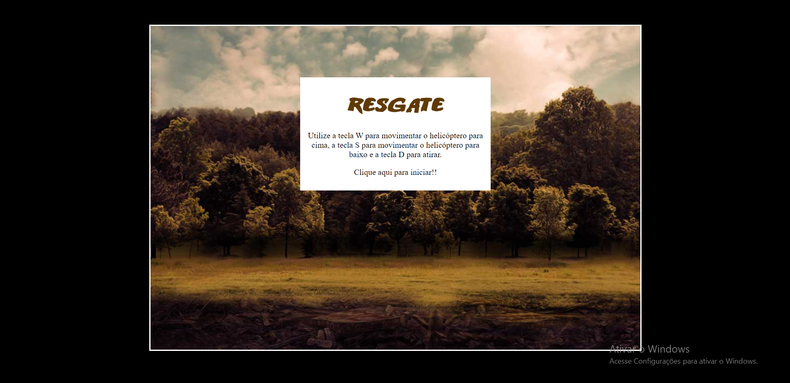
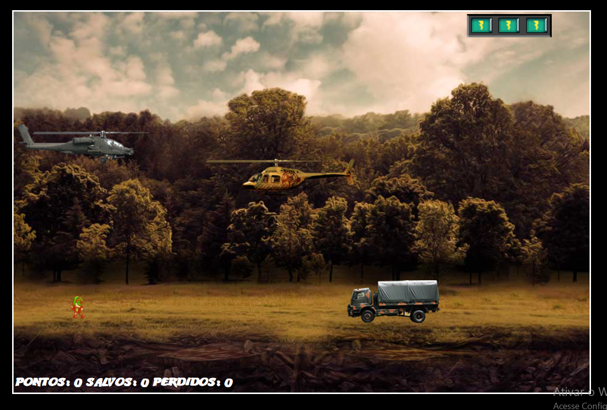
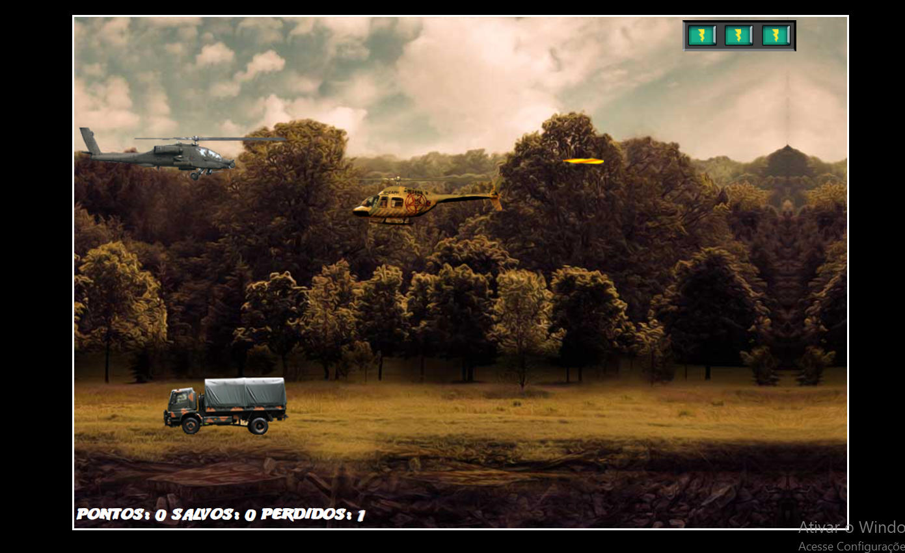
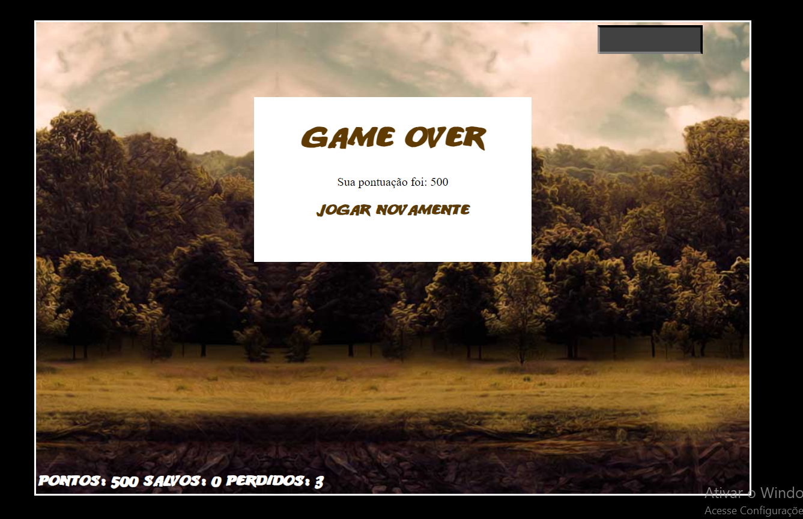

# Jogo Resgate

Criando meu primeiro jogo de naves web. Projeto realizado no bootcamp Órbi Web Games Developer presente na plataforma da DIO.
O jogo consiste em "resgatar" o "aliado" dos inimigos que estão presentes no mapa. O jogador controla uma aeronave enquanto os inimigos se dividem em dois tipos: uma aeronave e um caminhão, sendo este último uma ameaça direta ao "aliado" e o primeiro uma ameaça direta ao jogador. O jogo conta uma mecânica de disparo, onde o jogador pode eliminar inimigos e conquistar pontos. A cada aliada salvo aumentará o placar de "salvos" e a cada aliado perdido aumentará o placar de "perdidos"
O jogo termina quando o jogador perde as três barras de energia, que diminuem caso o jogador seja atingido por algum inimigo. Ao final do jogo será mostrado na tela a pontuação do jogador, que consiste em: pontos (medida por inimigos atingidos).

### Utilizei das seguintes tecnologias: HTML5, CSS3, JavaScript e JQuery.

# Imagens
## Tela inicial:

## Imagem do jogo:

## Representação do disparo:

## Game over:

